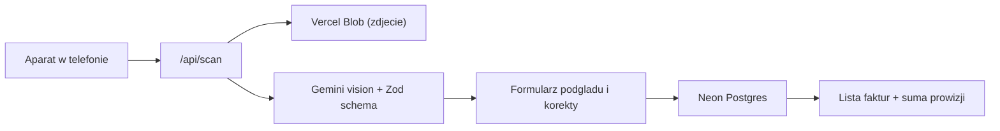

# Scano — skaner faktur z odczytem AI

Aplikacja PWA, w której robisz telefonem zdjęcie faktury. Gemini odczytuje z niego datę,
sprzedawcę, nabywcę i wartość, aplikacja zapisuje dane w bazie Postgres i wylicza prowizję
jako procent od wartości brutto.

## Lista kroków

- [ ] **Etap 1** — Fundament: Next.js + Tailwind + shadcn/ui, layout PWA, Vercel, Neon, Blob, logowanie hasłem
- [ ] **Etap 2** — Baza: schemat Drizzle, migracje, warstwa zapytań, wyliczanie prowizji
- [ ] **Etap 3** — Odczyt AI: Gemini + schemat Zod, endpoint `/api/scan`, upload zdjęcia
- [ ] **Etap 4** — Ekran skanowania: aparat, kompresja, formularz korekty, zapis
- [ ] **Etap 5** — Lista faktur, szczegóły, ustawienia, eksport CSV
- [ ] **Etap 6** — Wdrożenie na Vercel i test na telefonie

Każdy etap jest samodzielny: zaczyna się od opisu stanu wyjściowego i kończy kryterium
ukończenia, więc można go wykonać bez znajomości poprzednich rozmów.

## Jak to działa



Zdjęcie nie trafia do bazy od razu. AI odczytuje dane, użytkownik widzi je w formularzu,
poprawia jeśli trzeba i dopiero wtedy zapisuje. To ważne, bo faktury bywają pogniecione
i krzywe, a AI czasem pomyli cyfrę.

## Stack

- Next.js 16 (App Router, TypeScript) na Vercel, runtime Node.js
- Tailwind + shadcn/ui, interfejs po polsku, zoptymalizowany pod telefon
- PWA: manifest + ikony, żeby dało się dodać apkę do ekranu głównego
- Baza: Neon Postgres provisionowany przez Vercel Marketplace, dostęp przez Drizzle ORM
- Zdjęcia: Vercel Blob (prywatny)
- AI: Vercel AI SDK + `@ai-sdk/google` (Gemini), `generateObject` ze schematem Zod

## Docelowa struktura plików

```
app/
  layout.tsx            globalny layout, dolna nawigacja, metadane PWA
  page.tsx              lista faktur
  scan/page.tsx         robienie zdjecia i formularz korekty
  invoice/[id]/page.tsx szczegoly faktury
  settings/page.tsx     stawka prowizji
  login/page.tsx        ekran logowania haslem
  api/scan/route.ts     upload zdjecia + odczyt przez Gemini
  api/export/route.ts   eksport CSV
middleware.ts           blokada dostepu bez zalogowania
lib/
  db/schema.ts          tabele Drizzle
  db/index.ts           klient bazy
  db/queries.ts         zapytania: lista, pojedyncza, zapis, edycja, usuwanie, ustawienia
  ai/extract-invoice.ts prompt + schemat Zod + wywolanie Gemini
  fees.ts               wyliczanie prowizji
  money.ts              parsowanie i formatowanie kwot w formacie polskim
components/
  invoice-form.tsx      formularz uzywany przy skanie i przy edycji
  invoice-table.tsx     tabela z lp. i sumami
```

---

# Etap 1 — Fundament projektu i infrastruktura

**Kontekst startowy:** katalog projektu zawiera tylko `.env.local` (z kluczem Gemini i hasłem
wpisanym przez użytkownika), `.gitignore` oraz `docs/PLAN.md`. Brak repozytorium git.

**Do zrobienia:**

- `create-next-app` odmawia startu w katalogu zawierającym `.env.local`, więc na czas scaffoldu
  trzeba przenieść ten plik obok i przywrócić po zakończeniu — pod żadnym pozorem nie nadpisywać
  go wpisanymi już wartościami. Katalog `docs/` scaffold toleruje.
- `create-next-app` z TypeScript, Tailwind i App Router w bieżącym katalogu
- inicjalizacja shadcn/ui, komponenty: `button`, `input`, `label`, `card`, `table`, `sonner`, `dialog`
- globalny layout po polsku: `lang="pl"`, dolna nawigacja z trzema pozycjami
  (Faktury, Skanuj, Ustawienia), duże przyciski pod kciuk
- `app/manifest.ts` + ikony 192 i 512 px, `viewport` z `themeColor` i `viewportFit: "cover"`
- podłączenie projektu do Vercela, provisioning bazy Neon i Vercel Blob przez skill `marketplace`
- `vercel env pull .env.local` z zachowaniem wpisanego wcześniej klucza Gemini
- `git init` i pierwszy commit

**Zabezpieczenie hasłem** (część tego etapu, bo dotyka layoutu i każdej trasy):

- hasło w zmiennej `APP_PASSWORD`, obok niej `AUTH_SECRET` do podpisywania ciasteczka
- `app/login/page.tsx` z jednym polem hasła; server action porównuje wartość w sposób odporny
  na pomiar czasu i ustawia podpisane ciasteczko sesji (`httpOnly`, `secure`, `sameSite: lax`,
  ważność 30 dni, żeby nie logować się przy każdym otwarciu apki z ekranu głównego)
- `middleware.ts` przepuszcza tylko `/login` i zasoby statyczne, resztę przekierowuje na logowanie
- zdjęcia w Blob prywatne i serwowane przez własną trasę sprawdzającą sesję — inaczej sam adres
  pliku wystarczyłby do obejrzenia faktury

**Kryterium ukończenia:** `npm run dev` startuje bez błędów, wejście na stronę główną bez sesji
przekierowuje na `/login`, po podaniu hasła widać layout z nawigacją, a w `.env.local` są
`DATABASE_URL`, `BLOB_READ_WRITE_TOKEN`, `GOOGLE_GENERATIVE_AI_API_KEY`, `APP_PASSWORD`
i `AUTH_SECRET`.

---

# Etap 2 — Baza danych i warstwa zapytań

**Kontekst startowy:** działa projekt z Etapu 1, w `.env.local` jest `DATABASE_URL` do Neona.

**Do zrobienia:**

- instalacja `drizzle-orm`, `@neondatabase/serverless`, `drizzle-kit`, konfiguracja `drizzle.config.ts`
- `lib/db/schema.ts` — tabela `invoices`:
  - `id` (serial, klucz główny), `invoiceNumber`, `issueDate` (date)
  - `sellerName`, `sellerNip` — kto wystawił
  - `buyerName`, `buyerNip` — dla kogo
  - `grossAmount`, `netAmount`, `vatAmount` jako `numeric(12,2)` — nigdy `float`,
    bo liczby zmiennoprzecinkowe gubią grosze
  - `feeRate`, `feeAmount` — stawka prowizji użyta w momencie zapisu i wyliczona kwota;
    stawkę zapisujemy razem z fakturą, żeby późniejsza zmiana w ustawieniach nie przeliczała
    wstecz historii
  - `imageUrl`, `createdAt`
- tabela `settings` z jednym wierszem: domyślna stawka prowizji w procentach
- migracja `drizzle-kit generate` + `migrate` na Neona, seed wstawiający wiersz ustawień
- `lib/money.ts` — parsowanie polskich kwot (`"750,00"`, spacje jako separator tysięcy)
  na string dziesiętny i formatowanie z powrotem
- `lib/fees.ts` — wyliczenie prowizji na kwotach dziesiętnych, zaokrąglenie do grosza
- `lib/db/queries.ts` — `listInvoices` (filtr po zakresie dat i szukanie po nazwie), `getInvoice`,
  `createInvoice`, `updateInvoice`, `deleteInvoice`, `getSettings`, `updateSettings`

**Kryterium ukończenia:** tabele istnieją na Neonie, krótki skrypt zapisuje testową fakturę,
odczytuje ją i usuwa bez błędów; kwoty wracają z bazy identyczne co do grosza.

---

# Etap 3 — Odczyt faktury przez Gemini

**Kontekst startowy:** działa baza z Etapu 2. Do testów służy prawdziwe zdjęcie pogniecionej
faktury nr `0350/2026`: sprzedawca P.H.U. "Pecet" Mariusz Szczęsny (NIP 824-116-74-09),
nabywca Gmina Miedzna (NIP 8241723514), brutto 750,00, netto 609,76, VAT 140,24,
data wystawienia 12.08.2026.

**Do zrobienia:**

- instalacja `ai`, `@ai-sdk/google`, `zod`
- `lib/ai/extract-invoice.ts`: schemat Zod, w którym każde pole może być `null` — gdy AI czegoś
  nie odczyta, zostawiamy puste do ręcznego uzupełnienia zamiast zmyślonej wartości
- prompt po polsku z twardymi regułami: przecinek to separator dziesiętny (`750,00` to
  siedemset pięćdziesiąt złotych), data w formacie ISO, sprzedawca to strona wystawiająca,
  nabywca to odbiorca, kwoty bez symbolu waluty
- `app/api/scan/route.ts`: przyjęcie pliku z `FormData`, walidacja typu i rozmiaru, upload
  do Vercel Blob z dostępem prywatnym, wywołanie ekstrakcji, zwrot `{ imageUrl, data }`
- obsługa błędów: przekroczony limit API, nieczytelne zdjęcie, brak klucza — zrozumiałe
  komunikaty po polsku, nie surowy stack trace

**Kryterium ukończenia:** wysłanie przykładowego zdjęcia na `/api/scan` zwraca poprawnie
odczytane: numer `0350/2026`, datę `2026-08-12`, obu kontrahentów z NIP-ami oraz kwoty
750,00 / 609,76 / 140,24.

---

# Etap 4 — Ekran skanowania i zapis faktury

**Kontekst startowy:** działa `/api/scan` z Etapu 3 i zapytania z Etapu 2.

**Do zrobienia:**

- `app/scan/page.tsx` — duży przycisk „Zrób zdjęcie" oparty o
  `<input type="file" accept="image/*" capture="environment">`, alternatywnie wybór z galerii
- kompresja zdjęcia w przeglądarce przez canvas do maks. ok. 1600 px dłuższego boku przed
  wysłaniem, żeby upload z telefonu w słabym zasięgu nie trwał wieczność
- stan ładowania z informacją „Odczytuję fakturę…", bo Gemini potrzebuje kilku sekund
- `components/invoice-form.tsx` — formularz z odczytanymi danymi do korekty, obok miniatura
  zdjęcia do porównania; pola nieodczytane wyraźnie oznaczone jako wymagające uzupełnienia
- prowizja liczona na żywo z aktualnej stawki i wyświetlana pod kwotą brutto
- zapis przez server action, walidacja Zod po stronie serwera, ostrzeżenie gdy faktura
  o tym numerze i sprzedawcy już istnieje
- po zapisie przekierowanie na listę i potwierdzenie w toaście

**Kryterium ukończenia:** pełna droga od wybrania zdjęcia do wiersza w bazie działa lokalnie,
a formularz da się wypełnić ręcznie nawet gdy AI zwróci same puste pola.

---

# Etap 5 — Lista faktur, szczegóły, ustawienia i eksport

**Kontekst startowy:** faktury da się już zapisywać (Etap 4), w bazie jest kilka rekordów testowych.

**Do zrobienia:**

- `app/page.tsx` — tabela: lp., data, sprzedawca, nabywca, wartość brutto, prowizja.
  Lp. liczone przy wyświetlaniu, a nie brane z `id`, żeby usunięcie faktury nie robiło dziur
- podsumowanie: liczba faktur, suma wartości brutto, suma prowizji dla aktualnych filtrów
- filtr po zakresie dat i wyszukiwarka po nazwie kontrahenta lub numerze faktury,
  stan filtrów trzymany w parametrach URL
- na telefonie zamiast tabeli lista kart — sześć kolumn nie zmieści się na ekranie 390 px
- `app/invoice/[id]/page.tsx` — podgląd zdjęcia w pełnym rozmiarze, edycja przez ten sam
  `invoice-form`, usuwanie z potwierdzeniem
- `app/settings/page.tsx` — stawka prowizji w procentach, z wyraźną informacją, że zmiana
  dotyczy tylko nowych faktur
- `app/api/export/route.ts` — CSV z aktualnie przefiltrowanej listy, średnik jako separator
  i BOM UTF-8, żeby polski Excel otworzył plik poprawnie

**Kryterium ukończenia:** listę da się filtrować, sumy zgadzają się z filtrem, fakturę można
edytować i usunąć, a wyeksportowany CSV otwiera się w Excelu z poprawnymi polskimi znakami.

---

# Etap 6 — Wdrożenie i test na telefonie

**Kontekst startowy:** aplikacja działa lokalnie w komplecie.

**Do zrobienia:**

- sprawdzenie, że wszystkie zmienne środowiskowe są ustawione na Vercelu dla produkcji
- `npm run build` lokalnie, naprawa błędów typów i lintera, potem deploy na produkcję
- test na prawdziwym telefonie: zrobienie zdjęcia faktury, odczyt, zapis, obejrzenie listy
- instalacja PWA na ekranie głównym i sprawdzenie, że po otwarciu z ikony aparat nadal działa
- krótki `README.md`: jak uruchomić lokalnie, jakie zmienne są potrzebne, skąd wziąć klucz Gemini

**Kryterium ukończenia:** apka pod adresem produkcyjnym, zeskanowanie faktury telefonem kończy
się wpisem w bazie.

---

## Czego potrzeba od użytkownika

Przed Etapem 1: klucz API do Gemini z https://aistudio.google.com/apikey (darmowy limit
spokojnie wystarcza na kilkadziesiąt faktur dziennie) oraz zalogowanie do Vercela
w terminalu (`vercel login`).

W trakcie Etapu 1: hasło dostępu do aplikacji, wpisane do `.env.local` obok klucza Gemini.

Przed Etapem 6: telefon do testu.
