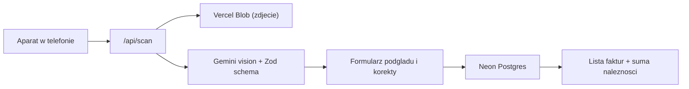

# Scano — skaner faktur z odczytem AI

Aplikacja PWA, w której robisz telefonem zdjęcie faktury. Gemini odczytuje z niego datę,
sprzedawcę, nabywcę i wartość, ty dopisujesz cenę, jaką sam zapłaciłeś za towar, a aplikacja
zapisuje dane w bazie Postgres i wylicza należność dla ciebie: `(brutto − cena dla mnie) / 1,23 / 1,19`,
czyli marżę po VAT 23% i podatku dochodowym 19%. Osobny ekran rozliczeń zbiera wypłaty tej
należności i pokazuje, ile z niej jeszcze zostało do wypłaty.

## Lista kroków

- [x] **Etap 1** — Fundament: Next.js + Tailwind + shadcn/ui, layout PWA, Vercel, Neon, Blob, logowanie hasłem
- [x] **Etap 2** — Baza: schemat Drizzle, migracje, warstwa zapytań, wyliczanie należności
- [x] **Etap 3** — Odczyt AI: Gemini + schemat Zod, endpoint `/api/scan`, upload zdjęcia
- [x] **Etap 4** — Ekran skanowania: aparat, kompresja, formularz korekty, zapis
- [x] **Etap 5** — Lista faktur, szczegóły, ustawienia, eksport CSV
- [ ] **Etap 6** — Wdrożenie na Vercel i test na telefonie
- [x] **Etap 7** — Rozliczanie należności: rejestr wypłat i saldo

Każdy etap jest samodzielny: zaczyna się od opisu stanu wyjściowego i kończy kryterium
ukończenia, więc można go wykonać bez znajomości poprzednich rozmów.

## Jak to działa



Zdjęcie nie trafia do bazy od razu. AI odczytuje dane, użytkownik widzi je w formularzu,
poprawia jeśli trzeba i dopiero wtedy zapisuje. To ważne, bo faktury bywają pogniecione
i krzywe, a AI czasem pomyli cyfrę.

## Stack

- Next.js 16 (App Router, TypeScript) na Vercel, runtime Node.js
- Tailwind + shadcn/ui, interfejs po polsku, zoptymalizowany pod telefon
- PWA: manifest + ikony, żeby dało się dodać apkę do ekranu głównego
- Baza: Neon Postgres provisionowany przez Vercel Marketplace, dostęp przez Drizzle ORM
- Zdjęcia: Vercel Blob (prywatny)
- AI: Vercel AI SDK + `@ai-sdk/google` (Gemini), `generateObject` ze schematem Zod

## Koszt odczytu AI

Darmowy plan AI Studio rozlicza się **liczbą zapytań, nie tokenami**: 20 odczytów na dobę,
liczonych osobno dla każdego modelu. Przy takim suficie każde niepotrzebne wywołanie boli
bardziej niż jego cena, dlatego aplikacja:

- nie ponawia zapytania po cichu (`maxRetries: 0`) — powtórka to świadoma decyzja użytkownika,
- pamięta ostatnio odczytane zdjęcia po skrócie SHA-256 i przy powtórnej wysyłce tego samego
  pliku oddaje poprzedni odczyt, nie pytając modelu,
- po wyczerpaniu limitu głównego modelu sięga po zapasowy (osobna pula na dobę),
- pokazuje w ustawieniach, ile odczytów zeszło dziś i ile tokenów w tym miesiącu.

Ustawienia modelu dobrane pomiarem (`npm run ai:cost`) na pogniecionej, obróconej fakturze
z blokiem ODBIORCA obok NABYWCY — czyli najtrudniejszym, jaki mamy:

| model | zdjęcie | myślenie | tokeny | czas | poprawnych pól |
| --- | --- | --- | --- | --- | --- |
| flash | HIGH | high (domyślne Gemini) | 3700 | 9,5 s | 9/9 |
| flash-lite | HIGH | low | 1790 | 2,0 s | 8/9 (wielkość liter w nazwie) |
| flash-lite | MEDIUM | low | 1266 | 1,9 s | 8/9 (wielkość liter w nazwie) |
| flash-lite | MEDIUM | minimal | 1266 | 1,9 s | 7/9 (NIP odbiorcy jako NIP nabywcy) |
| flash-lite | LOW | minimal | 982 | 2,5 s | 8/9 (przekłamany NIP sprzedawcy) |

Stąd `MEDIA_RESOLUTION_MEDIUM` i `thinkingLevel: "low"`. Niżej nie schodzimy: przy `LOW`
model gubi cyfry w drobnym druku, a przy `minimal` przestaje odróżniać nabywcę od odbiorcy.

## Docelowa struktura plików

Trasy aplikacji siedzą w grupie `(main)`, bo layout z dolną nawigacją i sprawdzeniem
sesji nie obejmuje ekranu logowania. Blokada dostępu to `proxy.ts`, a nie `middleware.ts` —
w Next.js 16 plik nazywa się inaczej niż w starszych wersjach.

```
app/
  layout.tsx                 globalny layout, metadane PWA
  manifest.ts                manifest PWA
  login/page.tsx             ekran logowania haslem
  (main)/layout.tsx          dolna nawigacja, sprawdzenie sesji
  (main)/page.tsx            lista faktur
  (main)/scan/page.tsx       ekran skanowania
  (main)/scan/scan-form.tsx  aparat, kompresja, wywolanie /api/scan
  (main)/invoice/[id]/       szczegoly faktury: zdjecie, edycja, usuwanie
  (main)/settlements/        saldo, formularz wyplaty, historia wyplat
  (main)/settings/page.tsx   zuzycie AI, wylogowanie
  api/scan/route.ts          upload zdjecia + odczyt przez Gemini
  api/image/[...path]/       serwowanie prywatnych zdjec z Blob
  api/export/route.ts        eksport CSV przefiltrowanej listy
proxy.ts                     blokada dostepu bez zalogowania
lib/
  db/schema.ts               tabele Drizzle
  db/index.ts                klient bazy
  db/queries.ts              zapytania: lista, pojedyncza, zapis, edycja, usuwanie,
                             licznik zuzycia AI
  ai/extract-invoice.ts      prompt, schemat Zod, ustawienia kosztu, model zapasowy
  ai/recent-scans.ts         pamiec ostatnich zdjec, zeby nie pytac dwa razy o to samo
  invoice-form.ts            typy i stan formularza wspolne dla klienta i serwera
  invoice-schema.ts          walidacja Zod danych z formularza
  invoice-actions.ts         server actions: zapis i usuwanie faktury
  invoice-filters.ts         filtry listy czytane z adresu URL
  settlement-form.ts         typy i stan formularza wyplaty
  settlement-schema.ts       walidacja Zod danych wyplaty
  settlement-actions.ts      server actions: zapis i usuwanie wyplaty
  image.ts                   kompresja zdjecia w przegladarce
  blob.ts                    sciezki i limity zdjec
  payout.ts                  wyliczanie naleznosci po VAT i podatku
  money.ts                   parsowanie i formatowanie kwot w formacie polskim
  dates.ts                   daty ISO
  auth.ts, session.ts        haslo i ciasteczko sesji
components/
  invoice-form.tsx           formularz uzywany przy skanie i przy edycji
  invoice-table.tsx          tabela na duzym ekranie, karty na telefonie
  invoice-filters.tsx        formularz filtrow (GET, bez JavaScriptu)
  bottom-nav.tsx             dolna nawigacja
scripts/                     recznie uruchamiane sprawdzenia: db, odczyt AI, formularz,
                             porownanie kosztu ustawien Gemini (ai-cost.ts)
```

---

# Etap 1 — Fundament projektu i infrastruktura

**Kontekst startowy:** katalog projektu zawiera tylko `.env.local` (z kluczem Gemini i hasłem
wpisanym przez użytkownika), `.gitignore` oraz `docs/PLAN.md`. Brak repozytorium git.

**Do zrobienia:**

- `create-next-app` odmawia startu w katalogu zawierającym `.env.local`, więc na czas scaffoldu
  trzeba przenieść ten plik obok i przywrócić po zakończeniu — pod żadnym pozorem nie nadpisywać
  go wpisanymi już wartościami. Katalog `docs/` scaffold toleruje.
- `create-next-app` z TypeScript, Tailwind i App Router w bieżącym katalogu
- inicjalizacja shadcn/ui, komponenty: `button`, `input`, `label`, `card`, `table`, `sonner`, `dialog`
- globalny layout po polsku: `lang="pl"`, dolna nawigacja z trzema pozycjami
  (Faktury, Skanuj, Ustawienia), duże przyciski pod kciuk
- `app/manifest.ts` + ikony 192 i 512 px, `viewport` z `themeColor` i `viewportFit: "cover"`
- podłączenie projektu do Vercela, provisioning bazy Neon i Vercel Blob przez skill `marketplace`
- `vercel env pull .env.local` z zachowaniem wpisanego wcześniej klucza Gemini
- `git init` i pierwszy commit

**Zabezpieczenie hasłem** (część tego etapu, bo dotyka layoutu i każdej trasy):

- hasło w zmiennej `APP_PASSWORD`, obok niej `AUTH_SECRET` do podpisywania ciasteczka
- `app/login/page.tsx` z jednym polem hasła; server action porównuje wartość w sposób odporny
  na pomiar czasu i ustawia podpisane ciasteczko sesji (`httpOnly`, `secure`, `sameSite: lax`,
  ważność 30 dni, żeby nie logować się przy każdym otwarciu apki z ekranu głównego)
- `middleware.ts` przepuszcza tylko `/login` i zasoby statyczne, resztę przekierowuje na logowanie
- zdjęcia w Blob prywatne i serwowane przez własną trasę sprawdzającą sesję — inaczej sam adres
  pliku wystarczyłby do obejrzenia faktury

**Kryterium ukończenia:** `npm run dev` startuje bez błędów, wejście na stronę główną bez sesji
przekierowuje na `/login`, po podaniu hasła widać layout z nawigacją, a w `.env.local` są
`DATABASE_URL`, `BLOB_READ_WRITE_TOKEN`, `GOOGLE_GENERATIVE_AI_API_KEY`, `APP_PASSWORD`
i `AUTH_SECRET`.

---

# Etap 2 — Baza danych i warstwa zapytań

**Kontekst startowy:** działa projekt z Etapu 1, w `.env.local` jest `DATABASE_URL` do Neona.

**Do zrobienia:**

- instalacja `drizzle-orm`, `@neondatabase/serverless`, `drizzle-kit`, konfiguracja `drizzle.config.ts`
- `lib/db/schema.ts` — tabela `invoices`:
  - `id` (serial, klucz główny), `invoiceNumber`, `issueDate` (date)
  - `sellerName`, `sellerNip` — kto wystawił
  - `buyerName`, `buyerNip` — dla kogo
  - `grossAmount`, `netAmount`, `vatAmount` jako `numeric(12,2)` — nigdy `float`,
    bo liczby zmiennoprzecinkowe gubią grosze
  - `costAmount` — cena, jaką sam zapłaciłem za towar; wpisywana ręcznie, bo na fakturze
    jej nie ma. Puste pole znaczy 0,00
  - `payoutAmount` — należność dla mnie wyliczona przy zapisie; trzymamy ją w kolumnie,
    żeby sumy na liście i w eksporcie liczyła baza, a nie każdy ekran po swojemu
  - `imageUrl`, `createdAt`
- migracja `drizzle-kit generate` + `migrate` na Neona
- `lib/money.ts` — parsowanie polskich kwot (`"750,00"`, spacje jako separator tysięcy)
  na string dziesiętny i formatowanie z powrotem
- `lib/payout.ts` — `(brutto − cena dla mnie) / 1,23 / 1,19` na groszach w `bigint`,
  jedno zaokrąglenie do grosza (połówki w górę), tak samo jak liczył to arkusz
- `lib/db/queries.ts` — `listInvoices` (filtr po zakresie dat i szukanie po nazwie), `getInvoice`,
  `createInvoice`, `updateInvoice`, `deleteInvoice`

**Kryterium ukończenia:** tabele istnieją na Neonie, krótki skrypt zapisuje testową fakturę,
odczytuje ją i usuwa bez błędów; kwoty wracają z bazy identyczne co do grosza.

---

# Etap 3 — Odczyt faktury przez Gemini

**Kontekst startowy:** działa baza z Etapu 2. Do testów służą trzy prawdziwe zdjęcia faktur
(katalog `samples/`, poza repozytorium — zawierają dane kontrahentów). Wszystkie od sprzedawcy
F.H.U. "Pecet" Mariusz Szczęsny (NIP 824-116-74-09), nabywca Gmina Miedzna (NIP 8241723514),
każda na jednej stronie:

| plik | numer | data | brutto | netto | VAT | zdjęcie |
| --- | --- | --- | --- | --- | --- | --- |
| `faktura-0326.png` | 0326/2026 | 2026-07-22 | 1107,00 | 900,00 | 207,00 | prosto |
| `faktura-0223.png` | 0223/2026 | 2026-05-22 | 735,00 | 597,56 | 137,44 | obrócone o 90° |
| `faktura-0350.png` | 0350/2026 | 2026-08-12 | 750,00 | 609,76 | 140,24 | obrócone o 180°, pogniecione |

Każda z nich wymienia trzy strony: sprzedawcę, nabywcę (Gmina Miedzna) i odbiorcę (Urząd Gminy
w Miedznie NIP 8241261373 albo Szkoła Podstawowa w Miedznie NIP 8241607506). Fakturę wiążemy
z nabywcą, więc odbiorcy nie zapisujemy — ale schemat ekstrakcji musi mieć na niego pola,
inaczej model wstawia NIP odbiorcy do NIP-u nabywcy.

**Do zrobienia:**

- instalacja `ai`, `@ai-sdk/google`, `zod`
- `lib/ai/extract-invoice.ts`: schemat Zod, w którym każde pole może być `null` — gdy AI czegoś
  nie odczyta, zostawiamy puste do ręcznego uzupełnienia zamiast zmyślonej wartości
- prompt po polsku z twardymi regułami: przecinek to separator dziesiętny (`750,00` to
  siedemset pięćdziesiąt złotych), data w formacie ISO, sprzedawca to strona wystawiająca,
  nabywca to odbiorca, kwoty bez symbolu waluty
- `app/api/scan/route.ts`: przyjęcie pliku z `FormData`, walidacja typu i rozmiaru, upload
  do Vercel Blob z dostępem prywatnym, wywołanie ekstrakcji, zwrot `{ imageUrl, data }`
- obsługa błędów: przekroczony limit API, nieczytelne zdjęcie, brak klucza — zrozumiałe
  komunikaty po polsku, nie surowy stack trace

**Kryterium ukończenia:** wysłanie każdego z trzech zdjęć na `/api/scan` (`npm run scan:check --
".\samples\faktura-0350.png"`) zwraca numer, datę, obu kontrahentów z NIP-ami i kwoty zgodne
z tabelą powyżej — również ze zdjęć obróconych i pogniecionych.

---

# Etap 4 — Ekran skanowania i zapis faktury

**Kontekst startowy:** działa `/api/scan` z Etapu 3 i zapytania z Etapu 2.

**Do zrobienia:**

- `app/scan/page.tsx` — duży przycisk „Zrób zdjęcie" oparty o
  `<input type="file" accept="image/*" capture="environment">`, alternatywnie wybór z galerii
- kompresja zdjęcia w przeglądarce przez canvas do maks. ok. 1600 px dłuższego boku przed
  wysłaniem, żeby upload z telefonu w słabym zasięgu nie trwał wieczność
- stan ładowania z informacją „Odczytuję fakturę…", bo Gemini potrzebuje kilku sekund
- `components/invoice-form.tsx` — formularz z odczytanymi danymi do korekty, obok miniatura
  zdjęcia do porównania; pola nieodczytane wyraźnie oznaczone jako wymagające uzupełnienia
- pole „cena dla mnie" wpisywane ręcznie, a pod nim liczona na żywo należność dla mnie
- zapis przez server action, walidacja Zod po stronie serwera, ostrzeżenie gdy faktura
  o tym numerze i sprzedawcy już istnieje
- po zapisie przekierowanie na listę i potwierdzenie w toaście

**Kryterium ukończenia:** pełna droga od wybrania zdjęcia do wiersza w bazie działa lokalnie
(`npm run form:check` sprawdza sam odcinek od `FormData` do bazy), a formularz da się wypełnić
ręcznie nawet gdy AI zwróci same puste pola.

---

# Etap 5 — Lista faktur, szczegóły i eksport

**Kontekst startowy:** faktury da się już zapisywać (Etap 4), w bazie jest kilka rekordów testowych.

**Do zrobienia:**

- `app/(main)/page.tsx` — tabela: lp., data, sprzedawca, nabywca, brutto, cena dla mnie,
  należność. Lp. liczone przy wyświetlaniu, a nie brane z `id`, żeby usunięcie faktury nie
  robiło dziur
- podsumowanie dla aktualnych filtrów: liczba faktur, suma zakupów, suma sprzedaży i suma
  należności — dokładnie te trzy sumy, które wcześniej stały w arkuszu
- filtr po zakresie dat i wyszukiwarka po nazwie kontrahenta lub numerze faktury,
  stan filtrów trzymany w parametrach URL
- na telefonie zamiast tabeli lista kart — tyle kolumn nie zmieści się na ekranie 390 px
- `app/(main)/invoice/[id]/page.tsx` — podgląd zdjęcia w pełnym rozmiarze, edycja przez ten sam
  `invoice-form` (należność przeliczana od nowa przy każdym zapisie), usuwanie z potwierdzeniem —
  razem z wierszem znika też zdjęcie z Bloba
- `app/(main)/settings/page.tsx` — zużycie AI i wylogowanie
- `app/api/export/route.ts` — CSV z aktualnie przefiltrowanej listy, średnik jako separator
  i BOM UTF-8, żeby polski Excel otworzył plik poprawnie

**Kryterium ukończenia:** listę da się filtrować, sumy zgadzają się z filtrem, fakturę można
edytować i usunąć, a wyeksportowany CSV otwiera się w Excelu z poprawnymi polskimi znakami.

---

# Etap 6 — Wdrożenie i test na telefonie

**Kontekst startowy:** aplikacja działa lokalnie w komplecie.

**Bez środowiska preview.** Jest jedno środowisko: produkcja pod
https://scano-beta.vercel.app. Projekt na Vercelu jest podłączony do
https://github.com/mbatorowicz/Scano, więc push na `main` sam wdraża produkcję; `npm run deploy`
(czyli `vercel deploy --prod`) wdraża od razu, bez commita. Pracujemy tylko na `main` —
`APP_PASSWORD`, `AUTH_SECRET` i `GOOGLE_GENERATIVE_AI_API_KEY` są ustawione wyłącznie dla
Production i Development, więc deployment preview z gałęzi wstanie, ale nie da się w nim
zalogować ani odczytać faktury. Vercel nie umie wymusić produkcji dla każdej gałęzi:
`git.deploymentEnabled` przyjmuje tylko listę konkretnych nazw, a nieokreślone gałęzie
deployują się domyślnie.

Baza Neon i Blob są wspólne dla lokalnego dev i produkcji, więc skan zrobiony lokalnie ląduje
w tych samych danych co skan z telefonu.

**Do zrobienia:**

- sprawdzenie, że wszystkie zmienne środowiskowe są ustawione na Vercelu dla produkcji
- `npm run build` lokalnie, naprawa błędów typów i lintera, potem `npm run deploy`
- test na prawdziwym telefonie: zrobienie zdjęcia faktury, odczyt, zapis, obejrzenie listy
- instalacja PWA na ekranie głównym i sprawdzenie, że po otwarciu z ikony aparat nadal działa
- krótki `README.md`: jak uruchomić lokalnie, jakie zmienne są potrzebne, skąd wziąć klucz Gemini

**Kryterium ukończenia:** apka pod adresem produkcyjnym, zeskanowanie faktury telefonem kończy
się wpisem w bazie.

---

# Etap 7 — Rozliczanie należności

**Kontekst startowy:** faktury liczą już należność przy zapisie (Etap 2) i sumują ją na liście
(Etap 5), ale nigdzie nie widać, ile z tego zostało wypłacone.

Rozliczenie to okrągła kwota (700, 1000, 1300, 1500 zł) wypłacana co kilka tygodni, a nie
zapłata za konkretne faktury. Dlatego wypłata nie wskazuje żadnej faktury — liczy się samo
saldo: suma należności minus suma wypłat. Wszystko dotyczy jednego sprzedawcy i wszystkich
nabywców razem, więc nie ma podziału na kontrahentów.

**Do zrobienia:**

- tabela `settlements`: `settledOn` (date), `amount` (`numeric(12,2)`), `note`, `createdAt`,
  indeks po dacie; migracja `0003_rozliczenia.sql`
- `lib/db/queries.ts` — `listSettlements`, `createSettlement`, `deleteSettlement` oraz
  `getBalance`. Sumy liczy baza (`coalesce(sum(...), 0)::text`) i oddaje jako tekst, bo
  `numeric` jest dokładny, a `number` po drodze gubiłby grosze
- saldo zawsze z całości, niezależnie od filtrów listy faktur — to stan konta, a nie widok
- `lib/settlement-form.ts`, `lib/settlement-schema.ts`, `lib/settlement-actions.ts` wzorem
  plików faktury; kwota wypłaty musi być większa od zera
- `app/(main)/settlements/` — karta salda (zarobione, wypłacone, do wypłaty), formularz wypłaty
  z przyciskami stałych kwot i historia wypłat z usuwaniem przez dialog z potwierdzeniem
- czwarta pozycja „Rozliczenia" w dolnej nawigacji i pasek salda z linkiem na liście faktur,
  wyraźnie opisany jako stan całości, żeby nie mylił się z sumami dla aktualnych filtrów

Ujemne saldo to nie błąd, tylko wypłata z góry — ekran nazywa je wtedy „Wypłacone z góry".

**Kryterium ukończenia:** po dodaniu wypłaty saldo na ekranie rozliczeń i na liście faktur
maleje o dokładnie tę kwotę, a po usunięciu wypłaty wraca do poprzedniej wartości co do grosza.

---

## Czego potrzeba od użytkownika

Przed Etapem 1: klucz API do Gemini z https://aistudio.google.com/apikey (darmowy limit
spokojnie wystarcza na kilkadziesiąt faktur dziennie) oraz zalogowanie do Vercela
w terminalu (`vercel login`).

W trakcie Etapu 1: hasło dostępu do aplikacji, wpisane do `.env.local` obok klucza Gemini.

Przed Etapem 6: telefon do testu.
